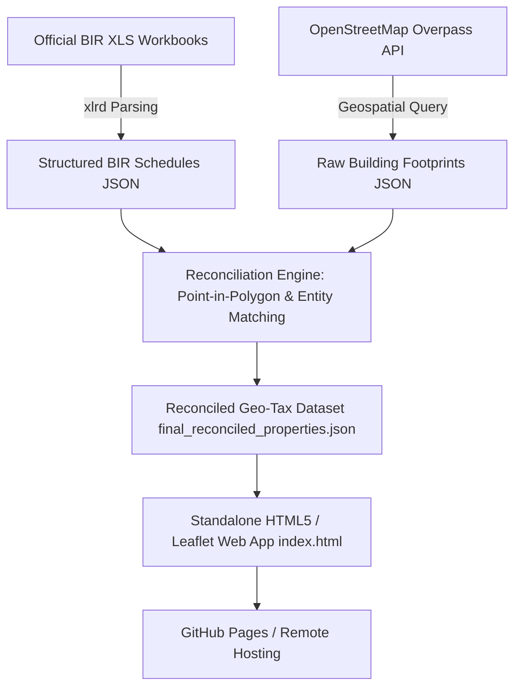
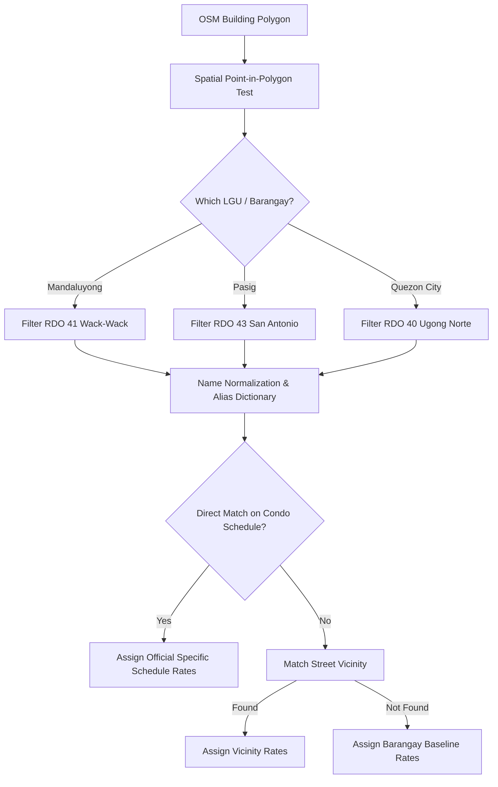

# Zonal Valuation Mapping Playbook
### A Technical Blueprint for Replicating Philippine BIR Zonal Valuation Maps for Any Central Business District (CBD) or Urban Zone

---

## Table of Contents
1. [Executive Summary & System Architecture](#1-executive-summary--system-architecture)
2. [Phase 1: Jurisdictional Scoping & Administrative Boundaries](#2-phase-1-jurisdictional-scoping--administrative-boundaries)
3. [Phase 2: Sourcing & Ingesting BIR Zonal Valuation Schedules](#3-phase-2-sourcing--ingesting-bir-zonal-valuation-schedules)
4. [Phase 3: Geospatial Footprint Extraction via OpenStreetMap](#4-phase-3-geospatial-footprint-extraction-via-openstreetmap)
5. [Phase 4: Entity Resolution & Point-in-Polygon Reconciliation](#5-phase-4-entity-resolution--point-in-polygon-reconciliation)
6. [Phase 5: Building the Interactive Cartographic Web Application](#6-phase-5-building-the-interactive-cartographic-web-application)
7. [Phase 6: Quality Assurance & Tax Data Traps](#7-phase-6-quality-assurance--tax-data-traps)
8. [Target Area Replication Recipes (BGC, Makati, Eastwood, Alabang)](#8-target-area-replication-recipes)

---

## 1. Executive Summary & System Architecture

The Bureau of Internal Revenue (BIR) of the Philippines publishes statutory Zonal Values (ZV) used to calculate capital gains tax, documentary stamp tax, donor's tax, and estate tax. Historically, these values are trapped in unstructured, legacy Excel workbooks (`.xls` BIFF8 format) with inconsistent column hierarchies, merged cells, and text-only address descriptions.

This playbook provides an end-to-end methodology to convert static BIR zonal schedules into a fully interactive, polygon-accurate, GIS-enabled web map.



### Key Deliverables Produced:
1. `data/raw/bir_excels/`: Exact binary copies of official BIR Excel schedules.
2. `data/raw/osm/`: Raw OpenStreetMap building geometry extractions.
3. `data/<area_name>/`: Cleaned, reconciled geo-tax records with complete provenance trails.
4. `index.html`: Client-side, zero-dependency GIS interface with 6-layer filtering and responsive inspection HUD.

---

## 2. Phase 1: Jurisdictional Scoping & Administrative Boundaries

### 2.1 The Multi-LGU Trap
Philippine commercial centers frequently transcend city boundaries. For example:
- **Ortigas Center** spans **3 LGUs** (Mandaluyong, Pasig, Quezon City) across **3 BIR Revenue District Offices (RDOs)**.
- **Bonifacio Global City (BGC)** sits entirely within Taguig (RDO 44), but borders Makati and Pateros.
- **Makati CBD** spans multiple barangays (Bel-Air, San Lorenzo, Urdaneta) split between RDO 48 and RDO 50.

> [!WARNING]
> **Avoid Cross-Zonal Contamination:**  
> Never parse an entire city's workbook without strict barangay filtering. Doing so will cross-contaminate CBD properties with adjacent residential suburban rates.

### 2.2 Finding the Correct RDO and Department Order (DO)
Every BIR revision is enacted through a Department Order issued by the Department of Finance. Check the official BIR directory:
- [BIR Zonal Values Portal](https://www.bir.gov.ph/index.php/zonal-values.html)

Identify:
1. **RDO Number** (e.g., RDO 41 for Mandaluyong, RDO 43 for Pasig, RDO 40 for Cubao/QC).
2. **Latest Department Order Number & Effectivity Date** (e.g., DO 059-2022, DO 024-2023, DO 021-2020).
3. **Specific Sheet Index** inside the workbook corresponding to the latest revision (often Sheet 7, 8, 9, or labeled `DO <number>`).
4. **Exact Barangay Name as written in the sheet** (e.g., `WACK-WACK -GREENHILLS EAST` vs `SAN ANTONIO`).

---

## 3. Phase 2: Sourcing & Ingesting BIR Zonal Valuation Schedules

### 3.1 Handling Legacy Excel Files
BIR workbooks are typically saved in the legacy **Excel 97–2004 (`.xls`) BIFF8 format**. Standard libraries like modern `openpyxl` will throw exceptions on these files. Always use `xlrd` (`pip install xlrd>=2.0.1`) or convert via headless LibreOffice.

### 3.2 BIR Classification Standard Codes
BIR schedules use six core classifications:

| Code | Name | Description | Mapping Role |
| :---: | :--- | :--- | :--- |
| **CR** | Commercial Regular | Raw land value for commercial lots | Primary lot baseline layer |
| **CC** | Commercial Condo | Commercial/office condominium units | High-rise office layer |
| **RR** | Residential Regular | Raw land value for residential plots | Townhouse / subdivision baseline |
| **RC** | Residential Condo | Residential apartment / condo units | High-rise residential layer |
| **PS** | Parking Slot | Condominium parking space valuation | Specialized condo parking layer |
| **X / GL** | Institutional / Gov | Hospitals, schools, churches, government | Civic & institutional layer |

### 3.3 Parsing Table Anomalies
BIR sheets are structured for print rendering rather than machine parsing:
- **Merged Headers**: Column names (`STREET NAME / CONDOMINIUM`, `VICINITY`, `CLASSIFICATION`, `ZV/SQ.M.`) appear repeatedly across page breaks.
- **Multi-Line Entries**: A condominium named in Row $N$ might list `RC` on Row $N$, `CC` on Row $N+1$, and `PS` on Row $N+2$ without repeating the building name.
- **Vicinity Markers**: Street rates often span distinct segments (e.g., `EDSA - ADB AVE.` vs `ADB AVE - SAN MIGUEL AVE.`).

#### Robust Multi-Line Parser Pattern (`scripts/03_parse_bir_schedules.py`):
```python
current_street_or_bldg = None
current_vicinity = None

for row_idx in range(start_row, end_row):
    col_street = sheet.cell_value(row_idx, 0).strip()
    col_vicinity = sheet.cell_value(row_idx, 1).strip()
    col_class = sheet.cell_value(row_idx, 2).strip().upper()
    col_rate = sheet.cell_value(row_idx, 3)

    if col_street:
        current_street_or_bldg = col_street
    if col_vicinity:
        current_vicinity = col_vicinity
        
    if col_class in ["CR", "CC", "RR", "RC", "PS", "X", "GL"]:
        # Emit parsed line item linked to current_street_or_bldg
        emit_record(current_street_or_bldg, current_vicinity, col_class, col_rate, row_idx)
```

---

## 4. Phase 3: Geospatial Footprint Extraction via OpenStreetMap

### 4.1 Bounding Box Definition
Determine the exact geographical bounds (Latitude / Longitude) of your target district. You can inspect bounds using [bboxfinder.com](http://bboxfinder.com).

*Example (Ortigas Center Bounding Box):*
- South: `14.5770`
- North: `14.5930`
- West: `121.0520`
- East: `121.0690`

### 4.2 Overpass QL Query Formulation
Query the Overpass API to extract all building ways and multipolygon relations with relevant tags:

```overpassql
[out:json][timeout:60];
(
  way["building"](14.577,121.052,14.593,121.069);
  relation["building"](14.577,121.052,14.593,121.069);
);
out body;
>;
out skel qt;
```

### 4.3 Node Reconstruction & Centroid Calculation
OSM returns `ways` as an ordered list of `node` IDs. To reconstruct usable GeoJSON / Leaflet polygons:
1. Index all returned nodes by ID into a coordinate dictionary `{node_id: [lat, lon]}`.
2. For each way, map `way.nodes` to their coordinate pairs.
3. Compute the geometric centroid $(\bar{\phi}, \bar{\lambda})$:
   $$\bar{\phi} = \frac{1}{N} \sum_{i=1}^N \phi_i, \quad \bar{\lambda} = \frac{1}{N} \sum_{i=1}^N \lambda_i$$
4. Capture OSM metadata tags: `name`, `addr:street`, `addr:housenumber`, `building:levels`, `amenity`.

---

## 5. Phase 4: Entity Resolution & Point-in-Polygon Reconciliation

Reconciliation bridges physical GIS geometry with statutory tax records.



### 5.1 Step A: Spatial Point-in-Polygon (Ray Casting)
Never rely solely on text addresses to determine jurisdiction. Perform ray-casting against official LGU/Barangay boundary polygons:
```python
def point_in_polygon(point, polygon):
    x, y = point  # lon, lat
    n = len(polygon)
    inside = False
    p1x, p1y = polygon[0]
    for i in range(n + 1):
        p2x, p2y = polygon[i % n]
        if y > min(p1y, p2y):
            if y <= max(p1y, p2y):
                if x <= max(p1x, p2x):
                    if p1y != p2y:
                        xinters = (y - p1y) * (p2x - p1x) / (p2y - p1y) + p1x
                    if p1x == p2x or x <= xinters:
                        inside = not inside
        p1x, p1y = p2x, p2y
    return inside
```

### 5.2 Step B: Name Normalization & Alias Dictionaries
OSM names differ from BIR legal registrations. Create an explicit alias dictionary:
- *OSM Name:* `"The St. Francis Shangri-La Place (Tower 1)"` $\rightarrow$ *BIR Name:* `"ST. FRANCIS SHANGRI-LA PLACE"`
- *OSM Name:* `"Robinsons Equitable Tower"` $\rightarrow$ *BIR Name:* `"ROBINSONS EQUITABLE TOWER CONDOMINIUM"`
- *OSM Name:* `"Megamall Building A"` $\rightarrow$ *BIR Name:* `"SM MEGAMALL"`

### 5.3 Step C: Provenance Tracking (`isOfficial`)
Every rate in your database must carry provenance metadata:
```json
"rates": { "CR": 200000, "CC": 189000, "RC": 168000, "PS": 118000 },
"isOfficial": { "CR": false, "CC": true, "RC": true, "PS": true },
"officialScheduleRef": {
  "name": "ST. FRANCIS SHANGRI-LA PLACE",
  "sheet": "Sheet 9 (DO 059-2022)",
  "row": 1500,
  "order": "D.O. 059-2022",
  "rdo": "RDO 41 (Mandaluyong)"
}
```
- `isOfficial: true`: The rate was explicitly assigned to this specific building in the schedule.
- `isOfficial: false`: The rate falls back to the statutory street or barangay baseline ("All Other Condos").

---

## 6. Phase 5: Building the Interactive Cartographic Web Application

To ensure 100% portability, hostability on GitHub Pages, and zero server maintenance, package the application as a single, self-contained `index.html`.

### 6.1 Architectural Principles
1. **Zero External Backend**: Embed the reconciled JSON directly into `index.html` or load asynchronously from `data/`.
2. **Leaflet.js + CartoDB Basemap**: Clean, high-contrast cartography (`CartoDB.Positron` or `CartoDB.DarkMatter`).
3. **6-Classification Layer Switching**:
   - The user toggles between `CR`, `CC`, `RR`, `RC`, `PS`, and `X/GL`.
   - Polygons update color dynamically based on their rate in the active layer.

### 6.2 UX Critical Rule: Greyed-Out & Non-Clickable Parcels
When a building has no rate for the active layer (e.g., a pure commercial office building has no `RC` residential condo rate):
- Render polygon in muted grey (`#475569`, opacity 0.25).
- **Set `interactive: false` on the polygon.**
- This prevents confusing clicks and tooltip errors on non-applicable properties.

### 6.3 Responsive Real-Time Inspection HUD
When an active property is clicked:
- Show active layer rate in prominent bold badge.
- Explicitly display whether the rate is an **Official Building Schedule** or a **Barangay Baseline Fallback**.
- Print the exact BIR Citation: Department Order, RDO, Sheet, and Row.
- Display a comprehensive comparison table of **all 6 classification rates** simultaneously.

---

## 7. Phase 6: Quality Assurance & Tax Data Traps

Before publishing any zonal map, run these automated verification checks:

1. **The Megamall / Pure Commercial Trap**:
   - Verify that non-residential commercial structures (like SM Megamall, ADB Headquarters, The Podium) do NOT display residential condo (`RC`) rates as official.
   - Any RC rate displayed must clearly indicate it is a barangay baseline fallback, or be suppressed.
2. **The Dual Tower Trap**:
   - Condominium complexes often comprise multiple towers with identical footprints in OSM or separate towers sharing a single BIR line item (e.g., St. Francis Towers 1 & 2).
   - Ensure both towers inherit the official rate.
3. **The Parking Slot Rate Check**:
   - Parking slot rates in BIR schedules are usually 60% to 75% of the condo unit rate. If a parking slot displays higher than the residential condo rate, check for column misalignment.
4. **Boundary Verification**:
   - Verify that properties along border streets (e.g., EDSA, Ortigas Avenue, Shaw Boulevard) are assigned to the correct side of the road / local government.

---

## 8. Target Area Replication Recipes

Here are ready-to-use parameter templates to replicate this pipeline for other premier Philippine CBDs:

### Recipe 1: Bonifacio Global City (BGC), Taguig
- **LGU**: City of Taguig
- **BIR RDO**: `RDO No. 44 - Taguig City / Pateros`
- **Primary Barangay**: `FORT BONIFACIO`
- **Target Bounding Box**:
  - `minLat: 14.5420, minLon: 121.0420, maxLat: 14.5580, maxLon: 121.0580`
- **Key Buildings to Match**: Serendra, Pacific Plaza Towers, Grand Hyatt Manila, High Street South, One Bonifacio High Street.

### Recipe 2: Makati Central Business District (CBD)
- **LGU**: City of Makati
- **BIR RDOs**: `RDO No. 48 - West Makati` & `RDO No. 50 - South Makati`
- **Primary Barangays**: `BEL-AIR` (Salcedo Village, Buendia), `SAN LORENZO` (Legazpi Village, Ayala Center), `URDANETA` (Roxas Triangle).
- **Target Bounding Box**:
  - `minLat: 14.5480, minLon: 121.0120, maxLat: 14.5650, maxLon: 121.0340`
- **Key Buildings to Match**: PBCom Tower, GT Tower, The Enterprise Center, Ayala Tower One, Discovery Primea, Park Central Towers.

### Recipe 3: Eastwood City, Quezon City
- **LGU**: Quezon City
- **BIR RDO**: `RDO No. 40 - Cubao`
- **Primary Barangay**: `BAGUMBAYAN`
- **Target Bounding Box**:
  - `minLat: 14.6060, minLon: 121.0770, maxLat: 14.6140, maxLon: 121.0840`
- **Key Buildings to Match**: Eastwood Cyber & Fashion Mall, One Eastwood Avenue, Eastwood Parkview, Olympic Heights.

### Recipe 4: Alabang / Filinvest City, Muntinlupa
- **LGU**: Muntinlupa City
- **BIR RDO**: `RDO No. 53B - Muntinlupa City`
- **Primary Barangay**: `ALABANG`
- **Target Bounding Box**:
  - `minLat: 14.4100, minLon: 121.0350, maxLat: 14.4280, maxLon: 121.0480`
- **Key Buildings to Match**: Festival Mall, Insular Life Corporate Centre, Entrata Urban Complex, Parkway Corporate Center.

---

## 9. Replication Script Execution Order

To run the pipeline from scratch for any area:

```bash
# 1. Download official BIR XLS workbooks
python scripts/01_download_bir_excels.py

# 2. Fetch raw OSM building geometries
python scripts/02_fetch_osm_buildings.py

# 3. Parse tabular schedules from BIR sheets
python scripts/03_parse_bir_schedules.py

# 4. Reconcile footprints, aliases, and statutory fallbacks
python scripts/04_reconcile_and_match.py

# 5. Compile into standalone interactive HTML5 map
node scripts/05_build_map_html.js
```
